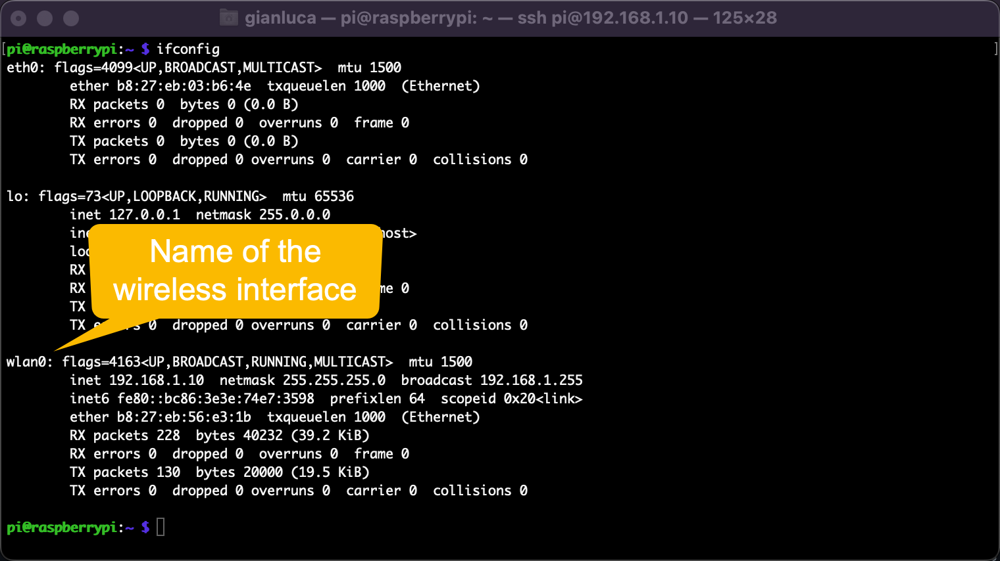

## How to configure Raspberry Pi for P2P connnection

### Step 1: Configure the network

Log into the Raspberry Pi, then go to `/etc/network`folder:

```
$ cd /etc/network`
```
Edit the `interfaces` file; however, for safety, save a backup copy:

```
$ sudo cp interfaces interfaces.backup
```
Raspberry Pi has several network interfaces. We mast make sire we select the wireless lan to enable P2P over WiFi.
To get information about network interfaces type:

```
$ ifconfig
```



### Step 2: Install the dhcp server


### Step 3: Configure the dhcp server
